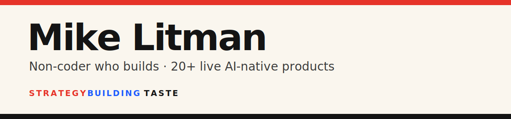

# Hi, I'm Mike 👋

I'm a **non-coder who builds**. After 15+ years in strategy and emerging tech (Google, Nike, Netflix, Meta, Gucci), I now ship AI-native products across image, video, voice and language without writing a line of code myself. Coding agents turned 20+ ideas into live products in under a year. Taste is the differentiator. I build between 9pm and midnight.

🌐 [Portfolio](https://mikelitman.me) · ✍️ [Newsletter](https://mikelitman.me/newsletter/) · 💼 [LinkedIn](https://linkedin.com/in/michaellitman) · 📖 [Book](https://www.amazon.co.uk/Getting-Started-web3-NFTs-introduction/dp/178017649X) · 📊 [Insights](https://mikelitman.me/insights)

> 💬 **Open to fractional & advisory work.** I help companies work out what AI actually changes for their creative and cultural business. Not decks, the real products and systems. [Say hello](mailto:hello@mikelitman.me).

<!-- Edit this "Building this week" line freely; the daily Action never overwrites it. -->
🔨 **Building this week:** shipping [The Pattern](https://thepattern.media) every morning and teaching this very profile to update itself.

<!-- PATTERN:START -->
> 📡 **Today's culture signal** · Pulse 74/100
> *Luxury is courting tech money by selling it the sea.* LVMH just built a yacht for tech billionaires. Old money is officially coming to new money, not the other way round. @ThePattern
> → [The Pattern, No. 125 · 29 June 2026](https://thepattern.media/editions/2026-06-29.html)
<!-- PATTERN:END -->

---

## ⭐ Featured projects

The ones people actually use.

🧠 [**CultureTerminal**](https://cultureterminal.com) (140+ sources) - Cultural intelligence, aggregated. 800+ articles scored weekly across fashion, brands, design, music, art and tech

📊 [**The Relevance Index**](https://therelevanceindex.com) (1,200+ brands) - Cultural relevance, scored. A hybrid model combining real-time data and AI analysis across five cultural domains, updated weekly

📞 [**Buggy Smart**](https://buggysmart.app) (10,000+ calls) - An AI voice agent that phoned 1,000+ London venues to ask one question: can a pushchair get through the door? Free interactive map, no ads, just real phone calls

🍽️ [**First Order**](https://first-order-london.netlify.app) (voice agent) - An AI voice agent that called hundreds of London restaurants to ask one thing: what should I order? Real dishes, straight from the kitchen

🔖 [**Trove**](https://www.yourtrove.app) (taste engine) - The Pocket alternative that actually does something. Save links, get a weekly briefing, discover your taste archetypes and search by meaning

⌚ [**EVERYWEAR**](https://everywear.media) (daily scored) - The only wearable-technology intelligence platform sitting at the intersection of fashion, culture and technology. No advertisers, no affiliate links, the WTI score is not for sale

🎨 [**Modern Retro**](https://modernretro.art) (100 brands) - What if today's brands existed in the 1970s? An AI-generated visual gallery reimagining 100 modern brands as vintage 1970s storefronts

---

## 🧠 Culture intelligence

Scoring what culture feels but can't usually measure.

🧠 [**CultureTerminal**](https://cultureterminal.com) (140+ sources) - 800+ articles scored weekly across fashion, brands, design, music, art and tech

📊 [**The Relevance Index**](https://therelevanceindex.com) (1,200+ brands) - Brands scored on cultural relevance using a hybrid real-time-plus-AI model across five domains

📰 [**The Pattern**](https://thepattern.media) (daily) - Daily culture intelligence, before it's obvious. A live editorial brief on the signals shaping brands and culture

🎯 [**Taste OS**](https://taste-os.netlify.app) (111 brands) - The framework for scoring brand taste. 5 dimensions, 100 points, a shared language for what we all feel but can't articulate

⌚ [**EVERYWEAR**](https://everywear.media) (daily scored) - Wearable-technology intelligence at the intersection of fashion, culture and technology

---

## 📞 AI voice agents

Agents that pick up the phone and gather data nobody else collects.

📞 [**Buggy Smart**](https://buggysmart.app) (1,000+ venues) - Called London venues to check pushchair access, mapped across 24 boroughs

🍽️ [**First Order**](https://first-order-london.netlify.app) (hundreds of calls) - Called London restaurants to find the one dish you have to order, straight from the kitchen

⏱️ [**Queue Index**](https://thequeueindex.com) (top 50) - Every Saturday at 1pm, calls London's top 50 restaurants to ask how long the wait is

---

## 🛠️ Apps & tools

Useful, opinionated apps that solve a real, everyday problem.

🚇 [**First Out**](https://firstout.app) (383 stations) - Where to stand on the platform for the quickest exit across London's rail network

🔖 [**Trove**](https://www.yourtrove.app) (taste engine) - The Pocket alternative that actually does something: save links, weekly briefing, taste archetypes, search by meaning

👶 [**Little London**](https://littlelondonco.com) (160+ activities) - 160+ hand-checked weekend activities for families with young kids in London, updated daily

🎨 [**Modern Retro**](https://modernretro.art) (100 brands) - Modern brands reimagined as 1970s storefronts, an AI-generated visual gallery

---

## ✍️ Latest writing

<!-- WRITING:START -->
- [AI collapsed the creative conveyor belt](https://mikelitman.me/blog/ai-collapsed-the-creative-conveyor-belt.html) · 13 Jun 2026
- [AI agents in production opening night](https://mikelitman.me/blog/ai-agents-in-production-opening-night.html) · 12 Jun 2026
- [How to write X articles people save](https://mikelitman.me/blog/how-to-write-x-articles-people-save.html) · 31 May 2026
<!-- WRITING:END -->

→ [more on the blog](https://mikelitman.me/blog/)

---

## 🧰 How I build

Strategy brain, builder's hands. Most of this is shipped with **Claude Code** plus a stack of generative tools (Runway, Stable Diffusion, Midjourney) wired into repeatable production pipelines. I don't write decks about what AI could do, I ship the thing and let it run. The full operational report, 238 posts, 28 live sites, 2,900+ commits in 90 days, lives on my [Insights page](https://mikelitman.me/insights).

📍 London · 🧠 Fractional Head of AI · 🏆 BIMA 100 Tech Pioneer · ✍️ Featured in AdAge & WSJ

---

<!-- STAMP:START -->
🤖 *This profile maintains itself. Every morning a GitHub Action pulls the live brief from The Pattern, refreshes each project's numbers, and lists my latest writing, then commits the change. Built and run by an agent. That's the whole point.* · **Last refresh: 30 June 2026**
<!-- STAMP:END -->
